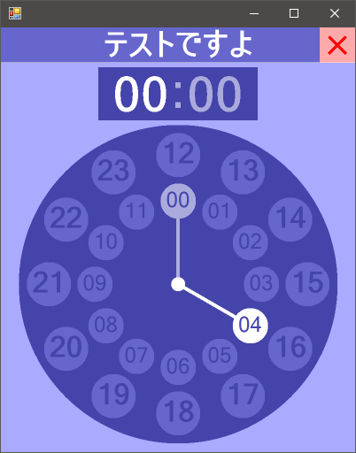
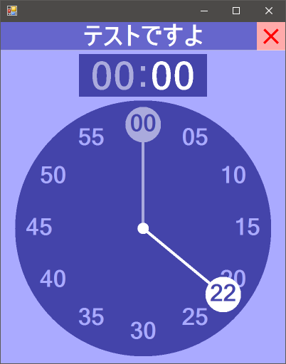

# TimePicker

Androidみたいな時刻入力をPowerShellで作ってみたくてやらかしました。

## 画面イメージ

| 時間入力モード | 分入力モード |
| :---: | :---: |
|  |  |

## つかいかた

### コンストラクタ

```powershell
# デフォルトのサイズでインスタンスを作成
$tp = New-Object TimePicker

# 指定位置かつデフォルトのサイズでインスタンスを作成
$tp = New-Object TimePicker(<int:左端位置>,<int:上端位置>)

# 指定位置とサイズでインスタンスを作成
$tp = New-Object TimePicker(<int:左端位置>,<int:上端位置>,<int:幅>,<int:高さ>)
```

### プロパティ

| プロパティ名称 | 型 | 規定値 | 説明 |
| :--- | :---: | :---: | :--- |
| Hour | int | 0 | 時間を示す整数値 |
| Minute | int | 0 | 分を示す整数値 |
| AutoNext | bool | false | true = 値入力時、次の項目に自動遷移する |
| Caption | string | "" | キャプション文字列 |
| Text | string | "00:00" | 時刻文字列 |

### メソッド

| メソッド名称 | 返り値 | 説明 |
| :--- | :---: | :--- |
| Open() | void | TimePickerを開く |
| Open(\<int:表示・入力モード\>) | void | 入力・表示モードを指定してTimePickerを表示する |
| Close() | void | TimePickerを開く |
| SetMode(\<int:表示・入力モード\>) | void | 入力・表示モードを指定する |

### 定数

| 定数名称 | 型 | 値 | 説明 |
| :--- | :---: | :---: | :--- |
| ModeHour | int | 0 | 時間入力モード |
| ModeMinute | int | 1 | 分入力モード |
| ModeMorning | int | 2 | 午前表示モード |
| ModeAfternoon | int | 4 | 午後表示モード |
